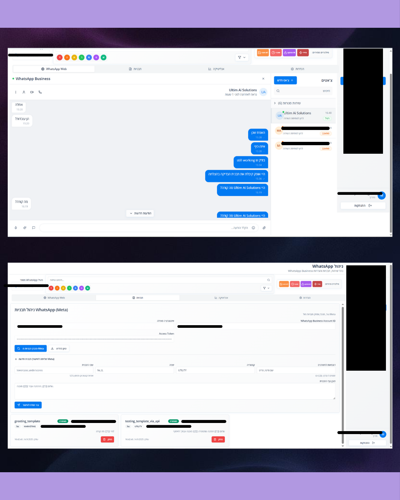
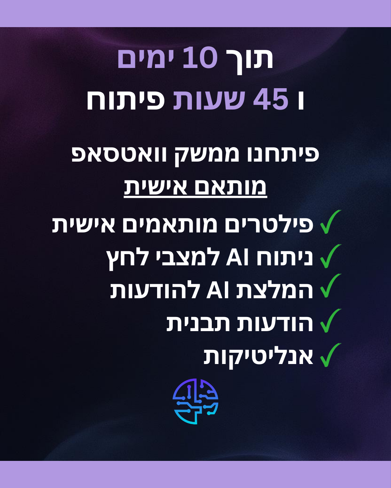
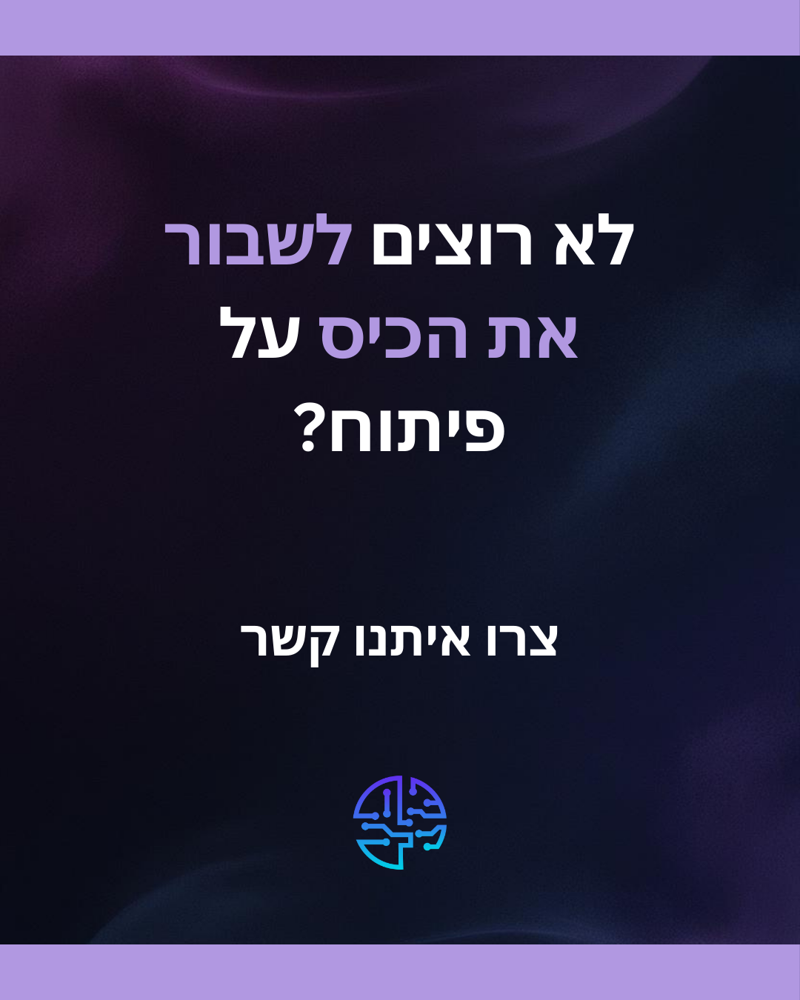
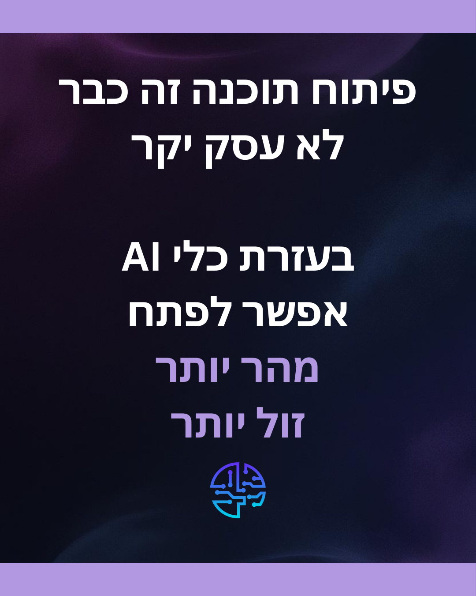

# 👋 Hi, I'm Ofek Loya

## AI-Driven Software Development | Saving Clients Thousands Through Intelligent Automation

I build custom software solutions powered by AI - delivering features in days, not months, at a fraction of traditional development costs.

Based in Beer Sheva, Israel | Building for startups, entrepreneurs, and small businesses

---

## 🚀 Featured Case Study: WhatsApp Business Integration

**Challenge:** Client needed a complete WhatsApp Business interface integrated into their customer support platform for digital course creators.

**Solution:** Built a comprehensive WhatsApp management system including:
- Template message management
- Real-time analytics dashboard
- Multiple integration handling
- Advanced filtering system
- **AI-powered response automation**

**Results:**
- ⚡ Delivered in **10 days** (vs. 1+ month typical timeline)
- 💰 **~9,000 NIS** in value delivered at **1/3 the market price**
- 🤖 AI automation reduced manual response time by over 60%

📋 <b>See Full Feature List</b>

**What was built:**
- ✅ Custom WhatsApp filters matching client needs
- ✅ AI analysis for intelligent message routing
- ✅ Recommended AI responses for common queries
- ✅ Technical infrastructure for analytics
- ✅ Analytics dashboard and reporting

**Timeline:** 10 days | 45 development hours

*Real-time analytics dashboard showing message performance and engagement metrics*

Built on Lovable (no-code) with custom integrations, demonstrating my hybrid approach: leverage rapid development tools where possible, write custom code where needed.

---

## 💼 Current Projects & Capabilities

### 🎥 TikTok Video Analysis Platform
Building an AI-powered platform that analyzes TikTok videos for viral potential prediction.
- **Tech Stack:** Python, OpenCV, YOLO (object detection), fine-tuned ML models
- **Features:** Automated video scraping from TikTok Studio, frame-by-frame analysis, virality scoring
- **Status:** In development for client (paid project)

### 🛒 Smart Cart Companion
Community-driven grocery price comparison platform with intelligent receipt scanning.
- **Tech Stack:** Custom OCR implementation, Python backend, cloud database
- **Features:** Receipt text extraction, price tracking, community price sharing
- **Innovation:** Built entire OCR pipeline from scratch - no pre-built APIs

### 🤖 AI Chatbots with Memory
Custom chatbot solutions that actually learn and remember context over time.

- **Tech Stack:** RAG (Retrieval-Augmented Generation), vector databases, fine-tuned language models
- **Capability:** Long-term conversation memory, domain-specific knowledge injection
- **Use Case:** Customer support, knowledge base automation, personalized user interactions

---

## 🛠️ Technical Stack

**Languages & Frameworks:**
- Python (Primary)
- JavaScript, HTML, CSS
- Full-stack development

**AI & Machine Learning:**
- Fine-tuned language models
- RAG (Retrieval-Augmented Generation) pipelines
- Vector databases for semantic search
- YOLO for computer vision tasks
- OpenCV for video/image processing

**Development Tools:**
- Lovable (no-code rapid prototyping)
- Supabase (backend/database)
- Cloud GPU instances for model training
- Git/GitHub for version control

**Specializations:**
- WhatsApp Business API integration
- Custom AI model training and deployment
- OCR and document processing
- Video analysis and computer vision
- API development and integration

---

## 📊 Why Work With Me?

**Speed Without Sacrificing Quality**
- AI-augmented development = faster delivery
- 10-day builds that would take others weeks

**Cost-Effective Solutions**
- Leverage AI to reduce development time
- Smart use of no-code + custom code
- Transparent pricing (400-2,000 NIS project range)

**Real AI Integration**
- Not just API calls to ChatGPT
- Custom fine-tuned models
- RAG systems with vector databases
- Actual computer vision implementation

**Built for Non-Technical Clients**
- Clear communication
- Professional documentation
- Scope protection with detailed specifications
- 30-day bug fix support included

---

## 📫 Let's Build Something

Got a project idea? Need AI integrated into your existing platform? Want to automate repetitive tasks?

**📱 DM me on Instagram:** [@ultimaisolutions](https://instagram.com/ultimaisolutions)

I work with entrepreneurs, startups, and small businesses across Israel who want to move fast and leverage AI to gain a competitive edge.

---

## 📈 Current Status

🎓 Expanding full-stack knowledge through Coursera certification  
🤖 Training custom AI models and building RAG systems  
💼 Taking on select client projects (2-3 active at a time for quality focus)  
📍 Based in Beer Sheva, Israel | Remote work for Israeli clients

---

### 🌐 Connect With Me

---

<i>Building AI-powered solutions that deliver real business value, not just impressive demos.</i>

